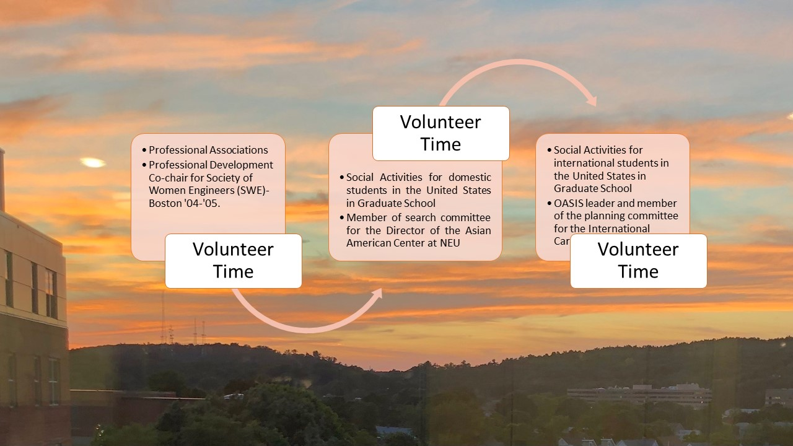

# Volunteer Community Services in America

Project provides an overivew of volunteer community services in America

### Professional Development Co-chair for Society of Women Engineers (SWE)-Boston '04-'05.

### OASIS leader and member of the planning committee for the International Carnevale '05 NEU

### Member of search committee for the Director of the Asian American Center at NEU

Additional details reference https://github.com/alpaddesai/CreatingandLeadingEffectiveOrganizations
